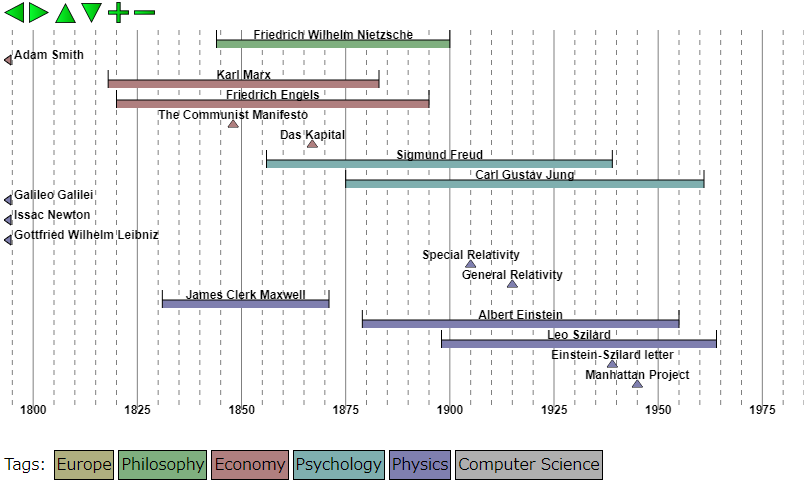

Timeline Viewer/Editor
======================

Historic Timeline Visualizer.
It can handle instantaneous events and entities with a timespan (such as person).

Try it now on your browser!
http://msakuta.github.io/Timeline/timeline.html

Screenshots
-----------

Introduction
------------

This little demonstration is created to show that an interactive timeline chart can be created with HTML5 easily.
I would like to introduce functionality to edit the timeline, but it's not implemented yet.

I am always having trouble remembering years and dates of important historical events and figures.
I wondered if I could make a little application to help me organize and remember history of events with the power of HTML5 and JavaScript.
I also wanted to associate tags with each event and person to quickly sort out the chart.

Because people tend to focus on what they're interested in, I think it's important to make it easily editable and organizable, rather than making it a huge chunk of history of everything.
The data file is simple JSON so that anyone can easily edit it.

Controls
--------

  * Left or Right arrow key to navigate towards past or future.
  * Up or Down arrow key to scroll vertically.
  * Plus (+) or Minus (-) key to change time scaling.
  * Mouse wheel also controls the time scale.

Wanted Features
---------------

  * Interactive editing
  * Adding detailed text with an item (which will show up in balloons or something)
  * Appending an image to an item
  * Exporting / Importing data
  * Multiple tags per item
  * Hyperlinking (to a Wikipedia page maybe)

Implementation Notes
--------------------

This projects uses HTML5 canvas for drawing the interactive timeline.
Considering rather static nature of the application, SVG picture would work better.
